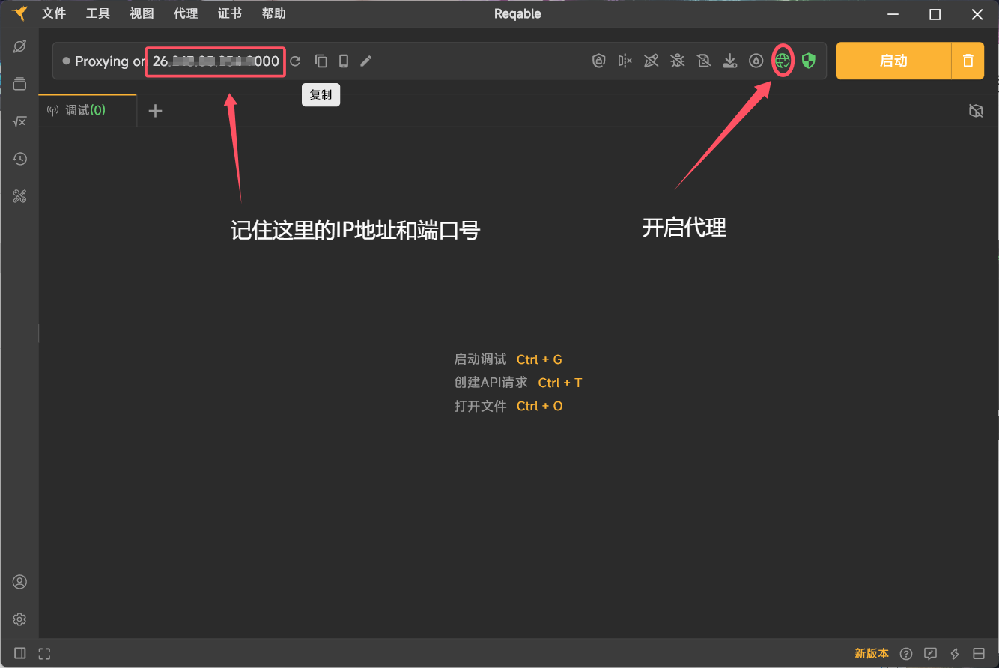
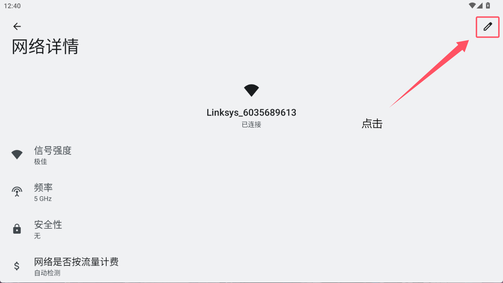
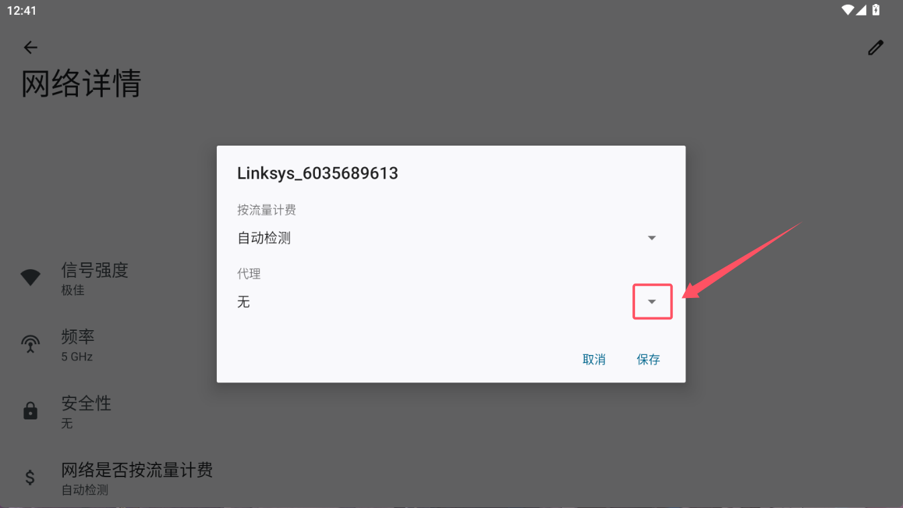
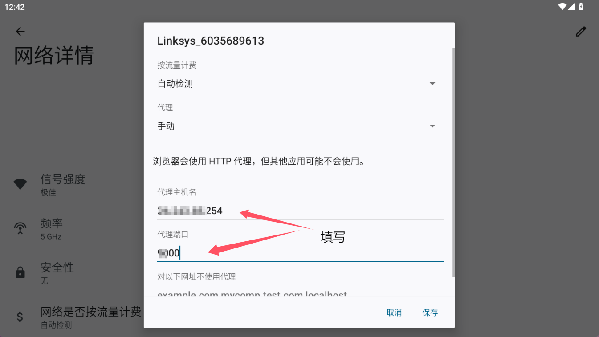
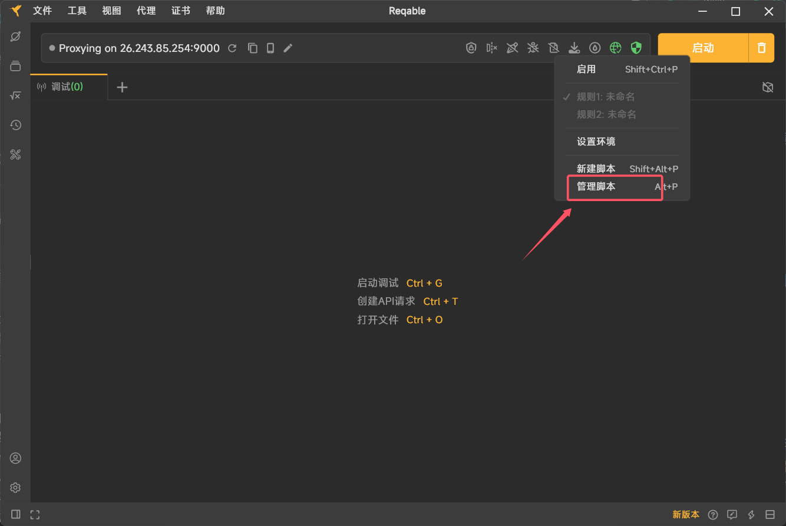
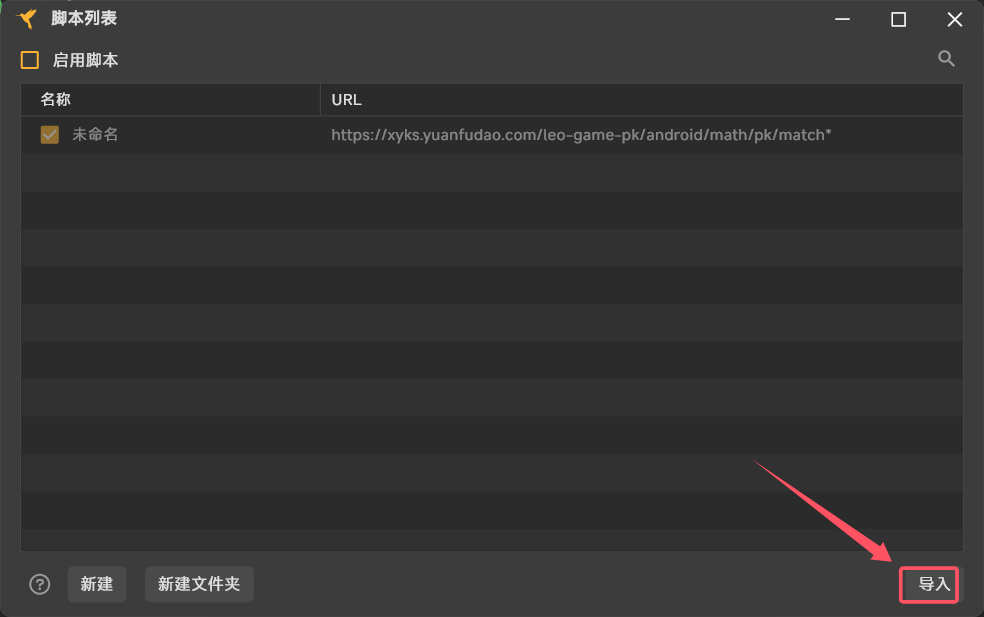
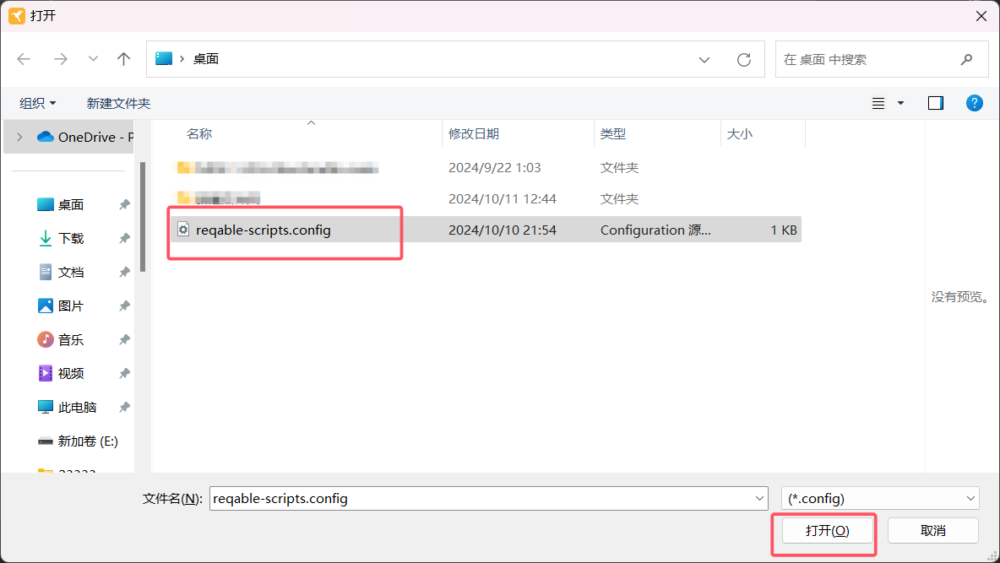
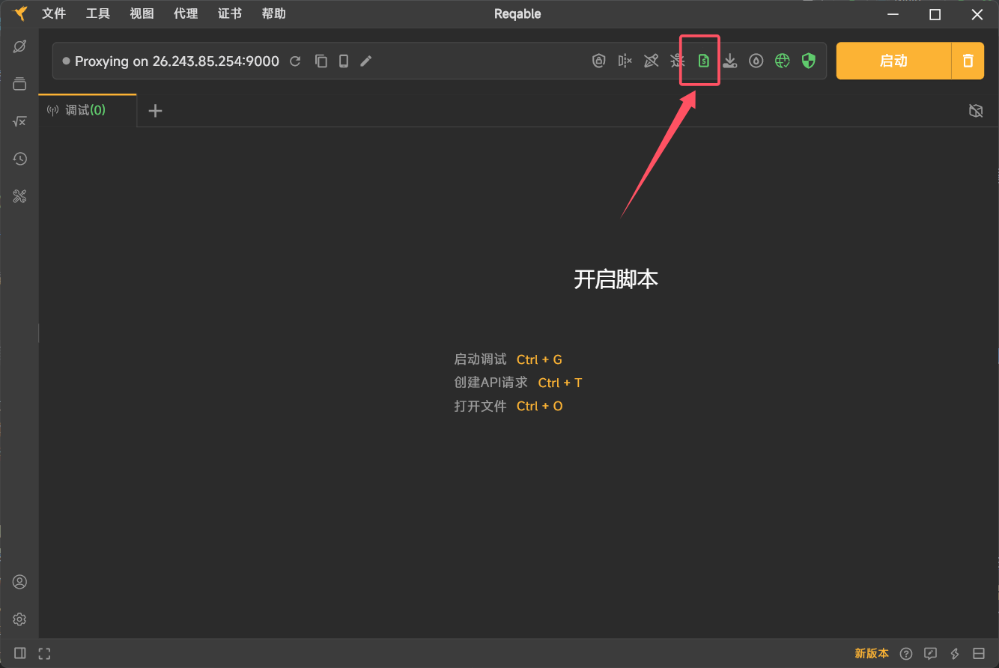
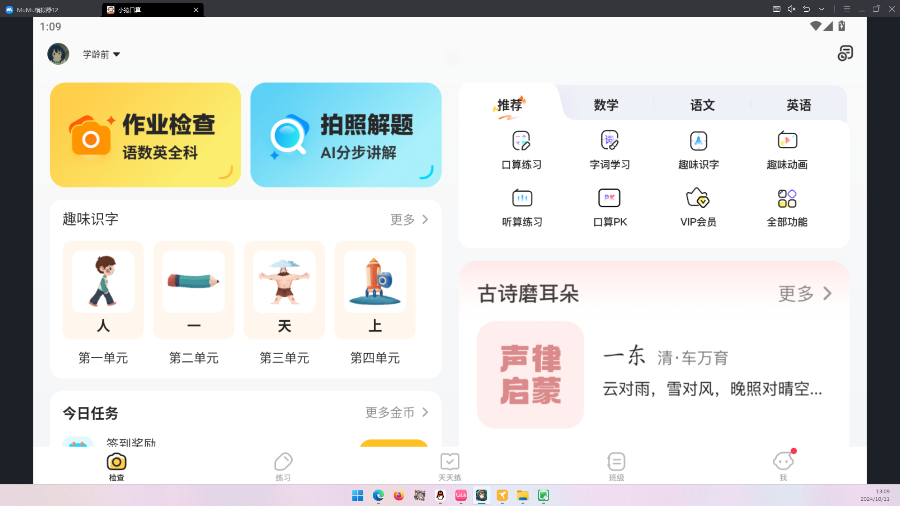
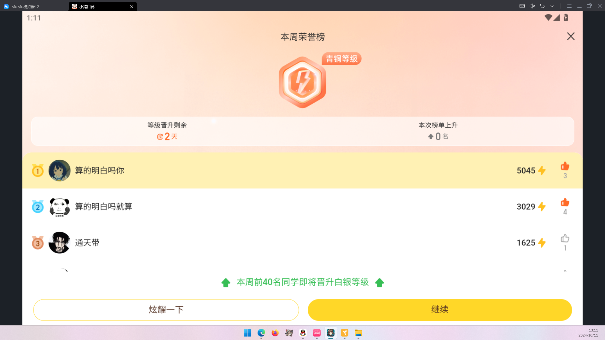

# 简介  
本项目是基于简单网络抓包和按键精灵脚本所实现的全自动高速小猿口算  
# 环境需求  
python3版本以上  
# 使用教程
## 各项软件安装
1. reqable[下载](https://reqable.com/zh-CN)
2. 按键精灵[下载](https://www.anjian.com)
3. 一个安装好小猿口算的模拟器（本教程使用的为mumu12模拟器）
4. reqable和按键精灵脚本文件[下载](https://github.com/qiushaonan/xiaoyuankousuan/archive/refs/heads/main.zip)

## reqable配置
1. 开启reqable代理，并复制左上角的ip地址及端口号

3. 打开模拟器的wifi设置，开启代理模式，并填写reqable的ip地址及端口号

5. 右键右上角脚本设置，打开管理脚本

7. 导入reqable脚本`reqable-scripts`，并启用脚本

9. 点击reqable右上角最醒目的启动
10. 此时不出意外的话，开启PK后答案全部篡改为了1

## 按键精灵配置
注意⚠️:此按键精灵脚本中没有图像识别的功能，
执行流程完全按照预设置的屏幕坐标点和固定休眠时间，
对使用者的显示屏的分辨率和缩放比例和启用的时机有硬性要求，
所以**泛用性极低**，但按键精灵为中文编程，学习成本低，可以稍微学习一下写一个属于自己的脚本
1. 调整显示器分辨率为1920*1080
2. 调整显示器缩放比例为100%
3. 横屏应用并全屏模拟器（非f11）如下图

5. 右键点击后，按导入脚本`我的脚本16_2024101184`
6. 开一把pk结束后点击领取15积分后按下按键精灵脚本启动键（就是下图情况），默认f10启动，f12暂停

8. 不出意外就成功了
